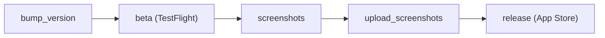

# 8 Ball Answer 🎱

Get it now on the App Store: [iOS](https://github.com/fulldecent/FDSoundActivatedRecorder/releases/tag/3.2.0)

A delightfully simple iOS + watchOS app for answering questions, 8 Ball Answer is perfect for providing entertainment and making randomized decisions. Just tap the screen and receive an answer!

**Features:**

- With a single tap, users may receive immediate responses to any question
- Randomized answer presets allow users to make decisions similar to flipping a coin, but with more complex answers
- Minimalistic and readable design allows users to easily see answers with an uncluttered, simple display
- Available on iOS and watchOS so users can ask questions on the go

# Installation ⚙️

To install and enjoy 8 Ball Answer, follow these simple steps:

1. **Download from the App Store**: 8 Ball Answer is available for download on the App Store for iOS & watchOS at this link: <https://apps.apple.com/us/app/8-ball-answer/id995732766>

2. **Launch the app**: Once installed, launch the app by tapping on its icon.

3. **Ask a question**: Tap on the screen to ask a question.

4. **Receive an answer**: After tapping, an answer to your question will appear on the screen.

# Gameplay visuals 📸

**Waiting screen before a question is asked:**

**Potential answer to a question:**


## Releasing a new version

The release process uses [fastlane](https://fastlane.tools).

One-time setup:

1. Install Ruby via rbenv (macOS system Ruby is too old for fastlane):

   ```sh
   brew install rbenv ruby-build
   rbenv init # follow the printed shell setup instructions, then restart your shell
   rbenv install   # installs the version from .ruby-version
   bundle install
   ```

2. Create `fastlane/api_key.json` with your App Store Connect API key details:

   ```json
   {
     "key_id": "ABCD123456",
     "issuer_id": "00000000-0000-0000-0000-000000000000",
     "key_filepath": "/absolute/path/to/AuthKey_ABCD123456.p8"
   }
   ```

The pipeline has five stages.



Execute the end-to-end flow with the combined command:

```sh
bundle exec fastlane ios full_release notes:"Maintenance update"
bundle exec fastlane mac full_release notes:"Maintenance update"
```

Or run individual stages:

1. Bump the marketing version (`MARKETING_VERSION`) and build number:

   ```sh
   bundle exec fastlane bump_version           # patch (default): 1.5 -> 1.5.1
   bundle exec fastlane bump_version bump:minor
   bundle exec fastlane bump_version bump:major
   ```

2. Build, sign, and ship to TestFlight for both iOS and macOS. Each `beta` lane bumps the build number, archives, exports, and uploads via `xcrun altool`:

   ```sh
   bundle exec fastlane ios beta
   bundle exec fastlane mac beta
   ```

   `ios beta` produces `build/8 Ball.ipa`, `mac beta` produces `build/8 Ball.pkg`. Both upload to the same App Store Connect record so the iOS build appears under the iOS TestFlight tab and the macOS build under the macOS TestFlight tab.

   :information_source: The iOS and macOS `beta` lanes upload via `xcrun altool` directly because fastlane's `upload_to_testflight` action currently fails for this app with a stale `previousBundleVersion` mismatch from Apple's ContentDelivery service. The legacy `upload_to_testflight` route is kept as `ios beta_pilot` so it can be re-enabled once Apple resolves the upstream issue.

3. Capture screenshots when needed. The iOS lane supports quick testing of one locale or one device:

   ```sh
   bundle exec fastlane ios screenshots
   bundle exec fastlane ios screenshots locales:en-US devices:"iPhone 17 Pro Max"
   ```

   This writes screenshots to `fastlane/screenshots/`.

4. Upload screenshots separately from submission:

   ```sh
   bundle exec fastlane ios upload_screenshots
   bundle exec fastlane mac upload_screenshots
   ```

5. Submit to the App Store. The `release` lanes are submit-only and do not capture or upload screenshots:

   ```sh
   bundle exec fastlane ios release notes:"Maintenance update"
   bundle exec fastlane mac release notes:"Maintenance update"
   ```

:information_source: If App Store Connect rejects a beta upload because the build number is behind the remote value, set the project build number once to remote highest + 1, commit that change, and then resume normal local increments.

:information_source: Our `before_all` hook in `fastlane/Fastfile` strips `/opt/homebrew` and `/usr/local` from `PATH` before `xcodebuild -exportArchive` runs. This is a workaround for a bug in Xcode 26's IPA packaging step ("Copy failed") because `/usr/bin/rsync` and Homebrew's `rsync` disagree on the `-E` flag.
